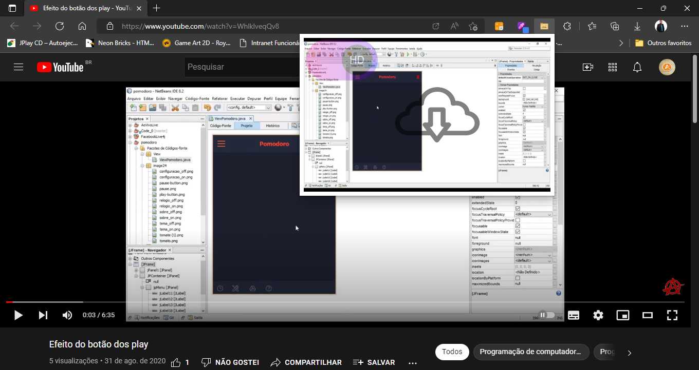

# Nome do Projeto 
<h1 align="center">
    <a href="https://pt-br.reactjs.org/">🔗 React</a>
</h1>

🚀 Extensão feita em javascript para chrome e edge para pre visualizar e premitir o download de thumbnail dos videos do yotube

<h1 align="center">
  
</h1>
